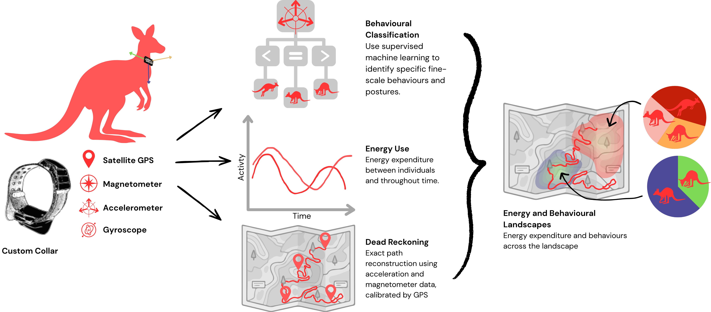

# KangarooProject
Understanding the movement of red kangaroos in the Australian desert as part of the PhD thesis of Jasmin Annett. In this repo: Loading in data from the Axivity boards, aligning with video footage, developing a machine learning behavioural classifier, and dead reckoning exact movement paths.

## Data
Data collected by Jasmin Annett from red and western grey kangaroos at Fownler's Gap, NSW. Data will be made available after publication of the manuscript.

## Workflow
This code is a customised instantiation of that found in the [Impala project](https://github.com/OakAlice/ImpalaProject/tree/main). Much of this code was recycled/ammalgamated from prior projects such as [data wrangling and dead reckoning](https://github.com/OakAlice/IntegratedCollarAnalysis) and [machine learning behavioural classification](https://github.com/OakAlice/AniML/tree/main). Specifically, this project is split into the following main sections:
1. Wrangling and time stamp alignment
2. Behavioural annotation
3. Machine learning behavioural classification 
4. Dead reckoning exact path reconstruction
5. Integrating behaviour, energetics, and location

Infomation and links to be filled in later...

## Contributions
Ethics, permitting, and project design and management by Jasmin Annett. Collar design by Robin Maag, Chris Bird, and Jasmin Annett. Animal collaring by Jasmin Annett, David Blyde, Christofer Clemente, Robin Maag, and me. Data wrangling, processing, machine learning, and dead reckoning by me. Data annotation by Amelia Nelson.
